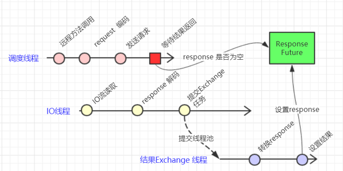

# trivial 1.2
## 简介
这是一个简单的RPC框架，基于netty，利用了fastjson进行序列化和反序列化（因此要注意Number类的传输规则）。
作为一个平凡的框架，它的好处在于让平凡的我们能看清像Dubbo那些优秀的框架的源头在哪里。
从初学者的角度出发，让人看得明白的设计思路和编码风格。
有关并发的细节，都有详细的解释。
## 关键词
netty，并发，线程池，原子变量，阻塞队列，并发队列，synchronized，volatile，自旋，反射，jdk动态代理
## 目前
1. 多线程rpc，保障每个线程调用的正确性。
2. 超时机制。
3. 基于yml文件来进行参数设置。
4. 客户端超时重试机制。
5. 增加业务线程池，用来处理可能涉及io的调用，转移netty线程的阻塞点。
6. 增加自己实现的业务线程池（性能未经测试）。
7. 观察者模式，用户可自定义超时策略。
8. 集群化，添加zookeeper注册中心。
9. 客户端可同时向多个服务端通信。
10. 空闲机制，空闲后服务端主动断开连接。
11. 随机选取服务。
12. 超时后下一次请求将随机重路由到其他机器上。
13. 异步调用，可避免lost-wake-up。
14. 客户端增加本地存根，注册中心宕机也可以连接到服务端。
15. 客户端设置消息高水位，防止发送队列积压。
16. 服务端利用LRU缓存，实现简单的防护，防止恶意攻击。
17. 增加动态服务降级，服务降级后，消费方不发起调用，直接返回null。
18. 集成到spring项目中
## 未来
7. 优化LRU并发操作。
8. 增加注解使用
9. 可以为客户端不同种类任务定制不同的超时机制。
10. 增加随机权重的负载均衡策略以及自定义策略。
11. 下一版本中完善服务监控与动态治理（容错，降级等）。
## 使用
example模块为样例，要安装lombok。
注意：
1. server提供的服务，应尽量是无状态的，具体解释在server的InvokeHandler.java invoke方法114行。
2. server提供的服务，如果是在spring环境中，那么需要注册Bean——TrivialSpringUtil。
## 简单同步调用时序图

## 简单异步调用时许图

## 设计思路与一些细节
### 注册中心
1. 服务端启动后，将自己可以提供的服务注册到zookeeper上，如：/trivial/Calculator/providors/127.0.0.1:8000。
2. 客户端要消费的时候，如消费Calculator，先检查缓存中有没有该服务的连接，没有就到注册中心的/trivial/Calculator/providors节点
下拉取子节点。经过过滤后，得到一个随机的地址，然后通信，进行调用。
### 客户端
1. 在构建连接时，为避免多个线程为一个服务对一个或多个服务端建立多个连接，采用了同步，先建立连接的线程将连接放到缓存，
后面的线程从缓存中拿取，同时也防止对同一个远程主机建立多个连接。
2. 线程调用前应该确保连接已经建立，可以进行通信，为此，有时要自旋等待。
3. 当某次服务调用超时，且重试失败后，那么这个服务端的地址将会被记录在客户端中该服务的黑名单中，且从该服务的连接缓存中删除（假断连）
客户端中的所有线程下次调用该服务时，将会忽略该服务端，但不影响消费该服务端提供的其他服务（不应该直接断连的，因为它的其他服务
有可能正常提供，而且有可能别的线程正在与之通信），用户可自定义超时策略。
4. 调用失败或者成功，都应该唤醒**相应的、对的**线程，返回**相应的、对的**结果，尤为重要，因此这里要抽取出统一的同步因素，
忽略不同线程、不同连接带来的差异性，这里每次调用都有相应的id，同样超时观察线程关注的也是调用的id。
5. 线程误与黑名单中的服务端建立通信是可以接收的，不进行强同步、增加编码难度。
6. 当连接断开后，旧的连接进入空闲的连接池，将来可以重用。（暂未搞懂怎么重用）
7. 客户端可以多个线程同时消费一个或多个服务端提供的服务，多个线程、多个连接互不干扰。
8. 超时扫描线程为daemon线程，不断工作，直至所有用户线程退出或者收到结束标志且队列中没有其他任务。检测到超时后将通知监听器，
调用监听器的相关方法。
9. 在异步调用获取结果时，由于检查resultMap和加入waiterMap阻塞自己不是原子性的，所以在这中间有可能出现lost-wake-up的情况，解决方
案为：不管同步或是异步，在发起调用时都加入waiterMap，在netty收到信息时，都去unpark调用线程（充分利用了unpark可以先调用，
先发放许可的特性，这样的话，虽然前面的操作不是原子性，但是却可以避免lost-wake-up)。因此，为保证这样的操作，在每次获取结果时都要把
本次的结果清空（以免下一次调用时获取到了上一次的结果），在每次调用前，要检查上一次的结果有没有获取了，如果没有（上一次异步调用没有
去获取结果），那么要先消费掉上一次的许可，即先LockSupport.park()。
### 服务端
1. 每次收到客户端发来的调用信息时，进行解码调用，如有线程池，则连同连接信息封装成任务，待任务完成后可以根据任务中的连接信息，
将结果写到相应的连接，交由相应的netty线程发送。
2. 服务端进行空闲计时，达最大空闲空闲时间后，断开连接。
3. 自实现的线程池在源码中（common模块下）有详细解释。
4. 服务端比客户端简单，因为没有太多要同步的地方。
## BUG回忆录
1. 消息丢失。connect方法调用时非阻塞，所以在真正要发送信息时确保已经连接成功，为此有时要自旋等待。
2. 异步调用时，lost-wake-up。充分了利用LockSupport.unpark可以先调用先发放许可的特性（但不能累积）。
3. 客户端发送完大量信息后，连接关闭。一开始认为是客户端的问题。解决历程如下：
   * 一开始认为是客户端的问题。
   * 尝试找到触发连接关闭的阈值，发现是在一次发送13条时触发。
   * 以为是触发了消息队列高水位，经排查不是。
   * 网上寻找相关问题无果。
   * 是不是抛出某种异常未被捕获，在exceptionCaught打印异常信息。**强烈建议小心的重写父类HandlerAdapter的方法，要考虑
   是否应该调用父类的方法，如在channelInactive中调用super.channelInactive。**
   * 在channelInactive中调用super.channelInactive，发现概率性地有信息返回，概率与发送数量和发送时是否调用Thread.yield()有关。
   **实际上连接早已断开，super.channelInactive中只不过是已经解码好的信息继续fireChannelRead **
   * 至此是服务端的问题，服务端捕获异常，在exceptionCaught打印异常信息，发现原来是线程池的默认的拒绝策略——抛弃抛异常(咋就没想到)
   ，异常在调用者线程即netty线程抛出，netty线程捕捉到异常断开了连接。调整任务队列大小，遭拒绝后将告知客户端，BUG解决。
   * 总的来说，难排查的原因有以下几个：
     * 此次BUG出现的背景是测试新功能——消息队列高水位和服务端基于LRU的简单防护机制，以为与新功能有关，实际是无关的，也怪自己在
     上一次稳定版本中没有进行完备的测试即发送大量消息，导致现在才发现，验证了BUG发现越晚越难排查这句话。
     * 没有打印异常信息也就是重写的时候要小心。**细节啊，细节啊。**
4. OOM，Direct内存溢出，没有释放请求ByteBuf，即没有继承SimpleChannelInboundHandler，没有fireChannelRead，
也没有ReferenceCountUtil.release。继承SimpleChannelInboundHandler，重写channelRead0。
5. 在持续一段比较高的并发后，发现很多线程park在RPCClientHandler的send处。解决历程如下：
   * 以为是我用了HashMap，在高并发的时候，一些调用结果被误删或者被覆盖，但是全部换上ConcurrentHashMap后，情况仍然存在。
   * 仔细分析后，发现，线程获取到的null，理论上这绝对不会出现，它unpark后，要么获取服务发来的结果，要么获取超时结果，
   但这里首次确实获得null，然后下次再发起调用时，发现存在上次服务端发来的结果，于是认为上次的结果没有去获取，于是park了。
   * 再分析，得知这个null是由于没有正确的park造成的，首次park时直接返回，去获取结果，于是就拿到了null。
   * park线程没有阻塞，在没有许可的条件下直接返回了，那么可能了caller被设置了中断标志，于是park才会直接返回。
   * park前检查中断标志，发现线程并没有中断。
   * 开始挠头。
   * park是否有线程不安全的说法？并没有。
   * 查看LockSupport.park()，发现有这么一段话，The call spuriously (that is, **for no reason**) returns，它有可能会无故返回！
   * 至此问题得以解决，在park返回后，确定是否已有调用结果，如果没有那么在循环中park。

## 与dubbo相异之处
1. trivial超时扫描线程使用blockingQueue；dubbo使用ConcurrentHashMap的值的集合视图。
详细比较参见：https://www.cnblogs.com/AllenDuke/p/12387493.html
2. trivial客户端不加入业务线程池，接收到结果时，由netty io线程经过简单解释后唤醒响应的线程，因为这个过程并不耗时且能快速响应；
dubbo加入业务线程池，接收到结果时，io线程封装成一个任务交予业务线程池，由业务线程池去唤醒调用者线程。如图：
   

如果你觉得对你有帮助的话，就给个star吧。
